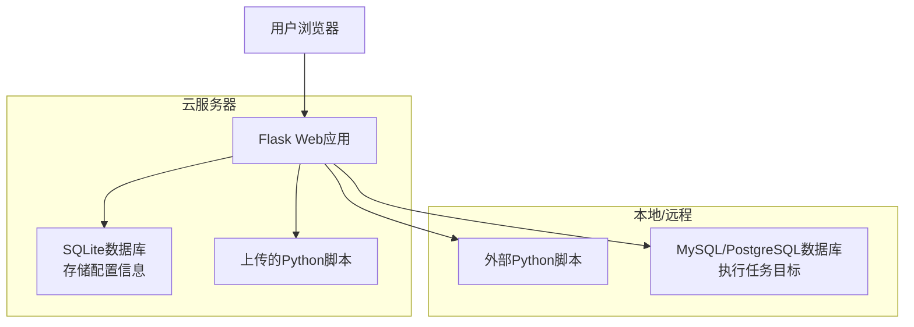
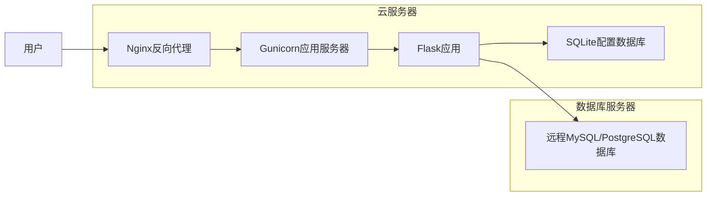

# 调度工具平台项目概述

## 项目简介

调度工具平台是一个基于Web的自动化任务调度系统，主要用于定时执行Python脚本和SQL脚本。该系统支持多种数据库连接，提供用户认证和权限管理，可以部署在云服务器上并连接远程数据库。

## 技术栈

### 后端技术
- **Python 3.x**: 主要编程语言
- **Flask**: Web框架，用于构建RESTful API和Web界面
- **SQLite**: 默认的元数据存储数据库
- **SQLAlchemy**: 数据库ORM工具（在excel_to_db.py中使用）
- **PyMySQL**: MySQL数据库连接驱动
- **Psycopg2**: PostgreSQL数据库连接驱动
- **Threading**: 多线程处理，用于并发执行任务
- **Subprocess**: 执行外部Python脚本
- **Hashlib**: 密码哈希加密

### 前端技术
- **HTML5**: 页面结构
- **Bootstrap 5**: 响应式CSS框架
- **jQuery**: JavaScript库，用于DOM操作和Ajax请求
- **Jinja2**: Flask模板引擎

### 数据库支持
- **SQLite**: 轻量级嵌入式数据库，用于存储调度任务配置
- **MySQL**: 关系型数据库，用于执行调度任务
- **PostgreSQL**: 关系型数据库，用于执行调度任务

## 项目结构

```
项目根目录/
├── web_scheduler.py          # Web应用主文件
├── excel_to_db.py            # Excel数据导入数据库工具
├── scheduler_app.py          # 桌面版调度工具（Tkinter）
├── requirements.txt          # Python依赖包列表
├── scheduler.db              # SQLite数据库文件
├── templates/                # HTML模板目录
│   ├── index.html            # 主界面模板
│   └── login.html            # 登录界面模板
├── static/                   # 静态资源目录
├── uploads/                  # 上传的Python脚本目录
├── deployment_guide.md       # 部署指南
└── project_overview.md       # 项目概述文档
```

## 核心功能模块

### 1. 用户认证模块

#### 技术实现：
- 使用Flask的Session机制管理用户登录状态
- 密码使用SHA-256哈希算法加密存储
- 装饰器模式保护API端点

#### 主要功能：
- 用户登录和登出
- 密码修改
- 新用户创建
- 会话管理

#### 相关文件：
- [web_scheduler.py](file://D:\gz\web_scheduler.py) - 用户认证API实现
- [templates/login.html](file://D:\gz\templates\login.html) - 登录界面
- [templates/index.html](file://D:\gz\templates\index.html) - 主界面（包含用户信息）

### 2. 任务调度模块

#### 技术实现：
- 独立线程运行调度器
- 时间间隔计算和任务触发机制
- 多线程执行任务避免阻塞

#### 主要功能：
- Python脚本任务调度
- SQL脚本任务调度
- 任务状态管理（启用/禁用）
- 立即执行任务
- 任务编辑和删除

#### 相关文件：
- [web_scheduler.py](file://D:\gz\web_scheduler.py) - 任务调度核心逻辑
- [templates/index.html](file://D:\gz\templates\index.html) - 任务管理界面

### 3. 数据库配置模块

#### 技术实现：
- 支持多种数据库类型（MySQL、PostgreSQL、SQLite）
- 数据库连接信息存储在SQLite中
- 动态数据库连接建立

#### 主要功能：
- 数据库连接配置管理
- 支持多种数据库类型
- 数据库配置的增删改查

#### 相关文件：
- [web_scheduler.py](file://D:\gz\web_scheduler.py) - 数据库配置API实现
- [templates/index.html](file://D:\gz\templates\index.html) - 数据库配置界面

### 4. SQL脚本管理模块

#### 技术实现：
- SQL脚本存储和管理
- 多语句SQL执行支持
- 与数据库配置关联

#### 主要功能：
- SQL脚本创建和编辑
- SQL脚本执行
- SQL脚本与数据库配置关联

#### 相关文件：
- [web_scheduler.py](file://D:\gz\web_scheduler.py) - SQL脚本API实现
- [templates/index.html](file://D:\gz\templates\index.html) - SQL脚本管理界面

### 5. 文件上传模块

#### 技术实现：
- Flask文件上传处理
- 文件存储在uploads目录
- 支持.py文件上传

#### 主要功能：
- Python脚本文件上传
- 上传文件管理
- 上传路径返回

#### 相关文件：
- [web_scheduler.py](file://D:\gz\web_scheduler.py) - 文件上传API实现
- [templates/index.html](file://D:\gz\templates\index.html) - 文件上传界面

### 6. Excel导入模块

#### 技术实现：
- Pandas库处理Excel文件
- SQLAlchemy ORM操作数据库
- 支持多种数据库连接

#### 主要功能：
- Excel文件读取
- 数据清洗和处理
- 数据库插入操作
- 表数据清空和重新导入

#### 相关文件：
- [excel_to_db.py](file://D:\gz\excel_to_db.py) - Excel导入核心功能
- [requirements.txt](file://D:\gz\requirements.txt) - 依赖包定义

## 项目开发历程

### 第一阶段：基础功能开发
1. 创建基础的Flask Web应用框架
2. 实现Excel数据导入数据库功能([excel_to_db.py](file://D:\gz\excel_to_db.py))
3. 设计数据库表结构（任务表、数据库配置表、SQL脚本表）

### 第二阶段：Web界面开发
1. 创建主界面模板([index.html](file://D:\gz\templates\index.html))
2. 实现前后端数据交互API
3. 添加任务管理功能（增删改查）
4. 添加数据库配置管理功能

### 第三阶段：调度功能实现
1. 实现任务调度器（定时执行任务）
2. 添加SQL脚本执行功能
3. 实现多线程任务执行避免阻塞

### 第四阶段：用户认证和权限
1. 添加用户登录和会话管理
2. 实现用户密码修改和新用户创建
3. 为所有API添加登录验证装饰器

### 第五阶段：功能完善和优化
1. 添加文件上传功能
2. 改进任务调度时间设置（支持分钟、小时、天等单位）
3. 实现任务编辑功能
4. 添加桌面版调度工具([scheduler_app.py](file://D:\gz\scheduler_app.py))

### 第六阶段：文档完善
1. 编写部署指南([deployment_guide.md](file://D:\gz\deployment_guide.md))
2. 编写项目概述文档([project_overview.md](file://D:\gz\project_overview.md))

## 数据流图



## 部署架构



## 安全特性

1. **用户认证**：基于Session的用户认证机制
2. **密码安全**：SHA-256哈希算法加密存储密码
3. **API保护**：装饰器保护所有API端点
4. **输入验证**：对用户输入进行验证和清理
5. **权限隔离**：不同用户只能操作自己的数据

## 性能优化

1. **多线程执行**：任务在独立线程中执行，避免阻塞主线程
2. **连接池**：数据库连接复用
3. **缓存机制**：适当使用缓存减少数据库查询
4. **异步处理**：长时间运行的任务异步处理

## 扩展性设计

1. **模块化架构**：各功能模块相对独立，易于扩展
2. **插件化数据库支持**：易于添加新的数据库类型支持
3. **API设计**：RESTful API设计便于第三方集成
4. **配置驱动**：大部分配置可通过界面完成，无需修改代码

## 使用的最佳实践

1. **定期备份**：定期备份[scheduler.db](file://D:\gz\scheduler.db)配置数据库
2. **权限管理**：合理分配用户权限，避免误操作
3. **监控日志**：关注任务执行日志，及时发现和解决问题
4. **资源管理**：合理设置任务执行间隔，避免系统资源耗尽
5. **安全更新**：定期更新依赖包，修复安全漏洞

## 未来发展方向

1. **任务依赖管理**：支持任务间的依赖关系
2. **任务分组**：支持任务分组管理和批量操作
3. **通知机制**：任务执行结果通知（邮件、短信等）
4. **可视化监控**：任务执行状态的可视化展示
5. **分布式支持**：支持分布式任务调度
6. **容器化部署**：支持Docker容器化部署